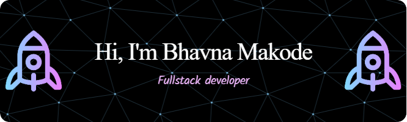

 &nbsp;
 &nbsp;

+ 🔭 I’m currently working on Frontend projects.
- 💬 Ask me about Web Development.
* 🌱 I’m passionate about Developing websites.
- 📝 I’m aiming to write one article per week starting from January 2024.
+ 🏆 I'm striving to increase my GitHub stats rating by contributing to open source.
* ⚡ Fun fact: I read books!

  
## 💻 My Tech Stack:

## 📖 Read My Blogs:

    &nbsp;&nbsp;
    &nbsp;&nbsp;

## 🏆 My Stats:

    &nbsp;&nbsp;
    &nbsp;&nbsp;

## 🤝 My Contributions and Badges:

